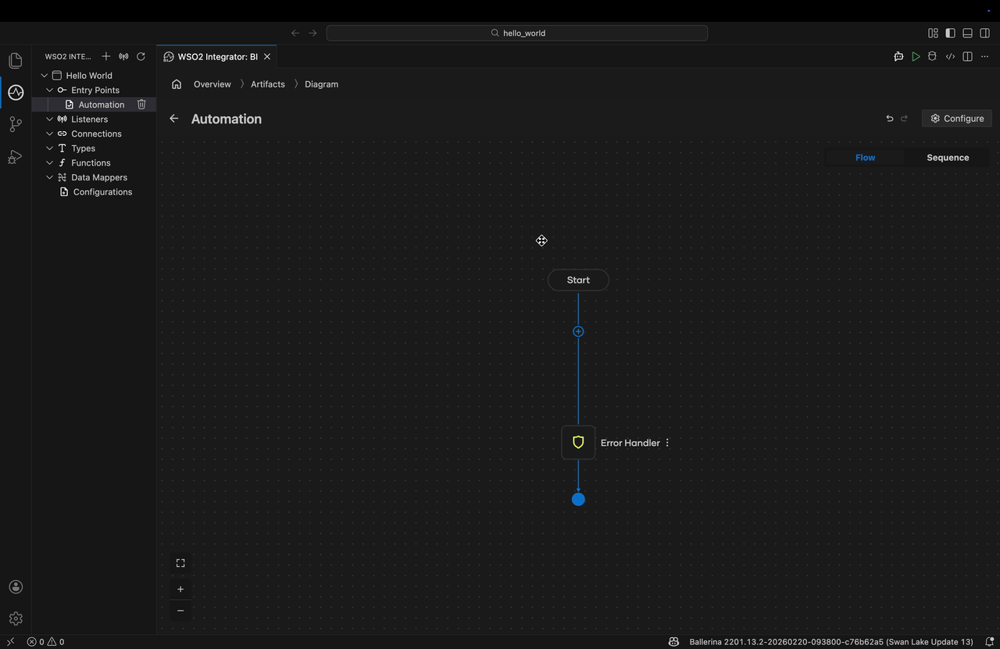

# FlowCast

FlowCast is a powerful tool designed to convert human instructions into GIFs by automating UI actions and recording the process. It uses LLMs to interpret instructions and computer vision to interact with applications.

## Table of Contents
- [Prerequisites](#prerequisites)
- [Installation](#installation)
- [Environment Setup](#environment-setup)
- [WSO2 Integrator Configuration](#wso2-integrator-configuration)
- [Usage](#usage)
- [Alternative Setup Options](#alternative-setup-options)
- [Important Permissions](#important-permissions)

---

## Prerequisites

- **OS**: macOS (Required for `osascript` and FFmpeg `avfoundation` support)
- **FFmpeg**: Required for screen recording and GIF generation.
  - Install via Homebrew: `brew install ffmpeg`
- **Python**: Version 3.11 or higher.

---

## Installation

We recommend using [uv](https://github.com/astral-sh/uv) for fast and reliable dependency management.

1.  **Install `uv`** (if not already installed):
    ```bash
    curl -LsSf https://astral-sh.uv.io/install.sh | sh
    ```
2.  **Sync Dependencies**:
    ```bash
    uv sync
    ```

---

## Environment Setup

FlowCast requires a `.env` file to manage API keys and model configurations.

1.  **Create the `.env` file**:
    ```bash
    cp .env.example .env
    ```
2.  **Configure the variables** in `.env`:
    - `GROQ_API_KEY`: Your API key from Groq.
    - `GROQ_VISION_MODEL`: The vision-capable model to use (e.g., `meta-llama/llama-4-scout-17b-16e-instruct`).
    - `LLM_PROVIDER`: Set to `groq`.

---

## Verifying Installation

To ensure everything is set up correctly, run the provided verification script:

```bash
uv run python verify_setup.py
```

This script will check your environment variables, system dependencies (like FFmpeg), and WSO2 Integrator paths.

---

## WSO2 Integrator Configuration

For workflows involving WSO2 Integrator, ensure the following paths are correct:

- **Application Path**: `$HOME/Applications/WSO2 Integrator.app`
- **Workspace Path**: `$HOME/wso2mi/workspace`

Make sure the app is installed in the standard `Applications` folder or update the workflow metadata accordingly.

---

## Example Workflow

Here is an example of how FlowCast interprets a workflow file (`workflows/hello_world.md`):

### Workflow Snippet
```markdown
### Step 3: Add println node

Click + after the Start node to open the node panel.
Select Call Function and select println.
Click Initialize Array.
Click Fx offset 100px right to click inside the value input "Hello World".
Enter '"Hello World"'.
Click Save.
Click the Run button in the top right to run the integration.
```

### Resulting GIF
FlowCast automates the steps and records the output:



---

## Usage

To run a workflow and generate GIFs:

```bash
# Run a full workflow
uv run python main.py path/to/workflow.md

# Run a specific step (e.g., Step 2)
uv run python main.py path/to/workflow.md --step 2

# Specify a custom output directory
uv run python main.py path/to/workflow.md output/my_recordings
```

---

## Alternative Setup Options

While `uv` is the recommended method, you can also use traditional Python tools:

- **Using `pip` and `venv`**:
  ```bash
  python3 -m venv .venv
  source .venv/bin/activate
  pip install -e .
  ```
- **Using `conda`**:
  ```bash
  conda create -n flowcast python=3.11
  conda activate flowcast
  pip install -e .
  ```

---

## Important Permissions

> [!IMPORTANT]
> Because FlowCast automates mouse movements and records your screen, you must grant the following permissions to your terminal (e.g., Terminal, iTerm2, or VS Code):
> 
> 1.  **Accessibility**: Required for `pyautogui` to control the mouse and keyboard.
> 2.  **Screen Recording**: Required for FFmpeg and `pyautogui` to capture the UI.
> 
> Go to **System Settings** → **Privacy & Security** to enable these.
